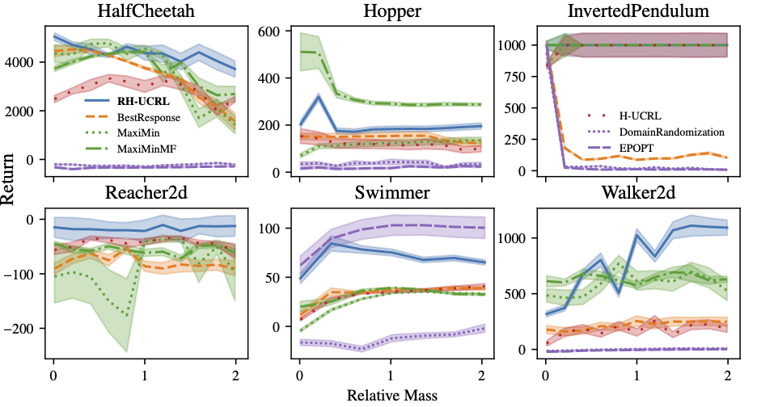
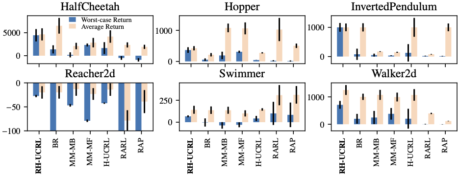

## Introduction

In this work, we address the challenge of finding a robust policy in continuous control tasks.
As a motivating example, consider designing a braking system on an autonomous car. 
As this is a highly complex task, we want to learn a policy that performs this maneuver.
One can imagine many real-world conditions and simulate them during training time e.g., road conditions, brightness, tire pressure, laden weight, or actuator wear. 
However, it is unfeasible to simulate all such conditions and these might vary in potentially unpredictable ways. 
The main goal is to learn a policy that provably brakes in a robust fashion so that, even when faced with new conditions, it performs reliably.

Of course, the first key challenge is to model the possible conditions the system might be in. 
Inspired in \\(\mathcal{H}_\infty\\) control and Markov Games, we model unknown conditions with an adversary that interacts with the environment and the agent. 
The adversary is allowed to execute adversarial actions at every instant by observing the current state and the history of the interaction. For example, if one wants to be robust to laden weight changes in the braking example, the adversary has the ability to choose the laden weight. 
By ensuring good performance with respect to the **worst-case** laden weight that an adversary selects, then we may also ensure good performance with respect to **any other** laden weight, and we say that **such policy is robust**. 

The main algorithmic procedure is to train our agent together with a ficticious adversary that simulates the real-world conditions we want to be robust to.
The key question we ask is **how to train these agents in a data-efficient way**. 
A common procedure is domain randomization, in which the adversary is simulated by sampling at random from a domain distribution. This has proved useful for sim2real applications, but it has the drawback that it requires many samples from the domain, as easy samples are treated equally than hard samples, and it scales poorly with the dimensionality of the domain.
Another approach is RARL, in which the adversary and the learner are trained through greedy gradient descent, i.e., without any exploration. 
Although it performs well in some tasks, we demonstrate that the lack of exploration, particularly by the adversary, yields poor performance. 

## Problem Setting

In this section, we formalize the ideas from the introduction. 

We consider a stochastic environment with states $s$, agent actions $a$, adversary actions $\bar{a}$, and i.i.d. additive transition noise vector $\omega$. 
The dynamics are given by:
\begin{equation}
    s_{h+1} = f(s_h, a_h, \bar{a}_h) + \omega_h
\end{equation}
We assume the true dynamics $f$ are **unknown** and consider the episodic setting over a finite time horizon $H$.
After every episode (i.e., every $H$ time steps), the system is reset to a known state $s_0$.
At every time-step, the system returns a reward $r(s_h, a_h, \bar{a}_h)$
We consider time-homogeneous policies agent policies $\pi$, that select actions according to $a_h = \pi(s_h)$, as well as
adversary policies $\bar{\pi}$ with $\bar{a}_h = \bar{\pi}(s_h)$.

We consider the performance of a pair of policies $(\pi, \bar{\pi})$ on a given dynamical system $\tilde{f}$ as the episodic expected sum of returns:
 $$
 \begin{align}
    J(\tilde{f}, \pi, \bar{\pi}) &:= \mathbb{E}_{\tau_{\tilde{f}, \pi, \bar{\pi}}}{ \left[ \sum_{h=0}^{H} r(s_h, a_h, \bar{a}_h) \, \bigg| \, s_0 \right]}, \\
    \text{s.t. }\;  s_{h+1}& = \tilde{f}(s_h,  a_h, \bar{a}_h) + \omega_h, \nonumber
\end{align}
$$

where $\tau_{\tilde{f},\pi,\bar{\pi}}$ is a random trajectory induced by the stochastic noise $\omega$, the dynamics $\tilde{f}$, and the policies $\pi$ and $\bar{\pi}$. 

We use $\pi^{\star}$ to denote the optimal robust policy from the set $\Pi$ on the true dynamics $f$, i.e.,
\begin{equation}
    \pi^\star \in \arg \max_{\pi \in \Pi} \min_{\bar{\pi} \in \bar\Pi} J(f, \pi, \bar\pi). \label{eq:objective}
\end{equation}

For a small fixed $\epsilon>0$, the goal is to output a robust policy $\hat{\pi}_{T}$ after $T$ episodes such that:

$$
\begin{align}
    \min_{\bar{\pi} \in \bar{\Pi}} J(f, \pi_T, \bar{\pi}) \geq \min_{\bar{\pi} \in \bar{\Pi}} J(f, \pi^{\star}, \bar{\pi}) - \epsilon,
\end{align}
$$

Hence, we consider the task of near-optimal robust policy identification. Thus, the goal is to output the agent's policy with near-optimal robust performance when facing its own **worst-case** adversary, and the adversary selects $\bar{\pi}$ **after** the agent selects $\pi_T$. 
This is a stronger robustness notion than just considering the worst-case adversary of the optimal policy, since, by letting $\bar{\pi}^* \in  \arg \min_{\bar{\pi} \in \bar\Pi} J(f, \pi^{\star}, \bar\pi)$, we have $J(f, \pi_T, \bar\pi^*) \geq \min_{\bar\pi \in \bar\Pi} J(f, \pi_T, \bar\pi)$.

## Method: RH-UCRL

In this section, we present our algorithm, RH-UCRL. It is a model-based algorithm that explicitly uses the **epistemic uncertainty** in the model to explore, both for the agent and for the adversary. 
In the next subsection, I will explain how we do the model-learning procedure, and in the following one, the policy optimization. 

### Model Learning

RH-UCRL is agnostic to the model one uses, as long as it is able to distinguish between epistemic and aleatoric uncertainty.
In particular, we build the set of all models that are **compatible** with the data collected up to episode $t$. This set is defined as $$\mathcal{M}_t = \{\tilde{f}(\cdot) \text{s.t.} \forall (\cdot)  \colon  \| \tilde{f} (\cdot) -\mu_{t-1} (\cdot) \|   \leq \beta_t \Sigma_{t-1}^{1/2}(\cdot) \}$$, where $\mu$ is a mean function and $\Sigma_{t-1}$ a covariance function. 

The set is parameterized by $\beta_t$ and it scales the confidence bounds so that the true model $f$ is contained in $\mathcal{M}_t$ with high probability for every episode. 
For some classes of models, such as GP models, there are closed form expressions for $\beta_t$. For deep neural networks, usually $\beta_t$ can be approximated via re-calibration. 

In this work, we decided to use probabilistic ensembles of neural networks as in PETS and H-UCRL. 
We train each head of the ensemble using type-II MLE with one-step ahead transitions collected up to episode $t$; we then consider the model output as a mixture of Gaussians. Concretely, each head predicts a Gaussian $\mathcal{N}(\mu_{t-1}^{i}(\cdot), \omega_{t-1}^{i}(\cdot))$. We consider the mean prediction as $\mu_{t-1}(\cdot) = \frac{1}{N} \sum_{i=1}^N \mu_{t-1}^{i}(\cdot)$, the epistemic uncertainty as $\Sigma_{t-1}(\cdot) = \frac{1}{N-1} \sum_{i=1}^N (\mu_{t-1}(\cdot) - \mu_{t-1}^{i}(\cdot)) (\mu_{t-1}(\cdot) - \mu_{t-1}^{i}(\cdot))^\top$, and the aleatoric uncertainty as $\omega_{t-1}(\cdot) = \frac{1}{N} \sum_{i=1}^N \omega_{t-1}^{i}(\cdot)$. Here, $\cdot$ represents the states $s$, the agent actions $a$ and the adversary actions $\bar a$. 

### Policy Optimization

Given the set of plausible models, we are able to construct **optimistic** and **pesimistic** estimates of the performance of any given pair of policies by optimizing w.r.t. the dynamics $\tilde{f}\in \mathcal{M}_t$.
Unfortunately, optimizing w.r.t. the dynamics is intractable, especially in non-linear models. 
For the particular case of Gaussian models we use a variant of the reparameterization trick. In particular, we introduce a function $\eta(\cdot): \cdot \to [-1, 1]^{n}$ and re-write the set of plausible models as $$\mathcal{M}_t = \{\tilde f (\cdot) \text{s.t.} \exists \eta,  \forall (\cdot) \colon \tilde{f} = \mu_{t-1}(\cdot) + \beta_t \Sigma_{t-1}^{1/2}(\cdot) \eta(\cdot) \}$$. 
The **key** observation is that optimizing over $\eta(\cdot)$ is easier than optimizing over $\tilde{f}$ as $\eta$ is a bounded Lipschitz function, whereas optimizing over $\tilde{f}$ requires solving a constrained optimization problem.  

For any two policies $\pi$ and $\bar\pi$, we denote the **optimistic** estimate as $J_t^{(o)}(\pi, \bar \pi)$ and the **pesimistic** estimate as  $J_t^{(p)}(\pi, \bar\pi)$.
The optimistic estimate is given by:

\begin{align}
	J_t^{(o)} (\pi, \bar\pi) &= \max_{\eta^o} J (f^{(o)}, \pi, \bar\pi) 
    \; \text{s.t.} \; f^o(\cdot) = \mu_{t-1}(\cdot) + \beta_{t} \Sigma_{t-1}^{1/2}(\cdot) \eta^o (\cdot). \label{eq:optimistic_performance}
\end{align}

Likewise, the pessimistic estimate is:
\begin{align}
	J_t^{(p)} (\pi, \bar\pi) &= \min_{\eta^p} J (f^{(p)}, \pi, \bar\pi) 
    \; \text{s.t.} \; f^p(\cdot) = \mu_{t-1}(\cdot) + \beta_{t} \Sigma_{t-1}^{1/2}(\cdot) \eta^p (\cdot). \label{eq:pessimistic_performance}
\end{align}

Both (5) and (6) are non-linear finite-horizon optimal control problems, where the policies are the function $\eta$, and the controls act linearly on the dynamics. Optimizing over $\eta$ is equivalent to optimizing over $\tilde{f} \in \mathcal{M}_t$. 

The next step is to select the agent and adversary policies to deploy in the next episode. The R-HUCRL algorithm selects for the agent the policy that is **most optimistic** for any adversary policy, and for the adversary the policy that is **most pessimistic** for the selected agent policy. In equations, the algorithm is: 

$$
\begin{align}
    \pi_t &\in \arg\max_{\pi \in \Pi} \min_{\bar\pi \in \bar\Pi} J_{t}^{(o)}(\pi, \bar\pi), \label{eq:rhucrl:learner} ,\\
    \bar\pi_t &\in \arg\min_{\bar\pi \in \bar\Pi} J_{t}^{(p)}(\pi_t, \bar\pi) .  \label{eq:rhucrl:adversary}
\end{align} 
$$

Finally, after $T$ episodes, the algorithm returns the agent policy that had the largest pessimistic performance throughout the training phase, 
$$
\begin{align}
    \hat{\pi}_T = \pi_{t^\star}\; \text{ s.t. } \; t^\star \in \arg\max_{t \in \{1, \ldots, T\} } J_{t}^{(p)}(\pi_t, \bar\pi_t). \label{eq:rhucrl:output}
\end{align}
$$

Note that this quantity is computed in (8) and thus the last step has no extra cost. 

### Theory

The main theoretical contribution of our paper says that under some technical assumptions, and the number of episodes $T$ is large enough, i.e., when

$$
\begin{align}
    \frac{T}{\beta_{T}^{2H}\Gamma_{T}} \geq \frac{16L_r^2 H^3C^{2H}}{ \epsilon^2},
\end{align}
$$

then, the output $\hat{\pi}_T$ of RH-UCRL in (9) satisfies

$$
\begin{align}
    \min_{\bar\pi \in \bar \Pi} J(f, \hat{\pi}_T, \bar \pi) \geq \min_{\bar\pi \in \Pi} J(f, \pi^{\star}, \bar \pi) - \epsilon
\end{align}
$$

This is exactly the performance that we cared about in the problem setting in Equation (4). 
So what are these terms in equation (10)? Will these condition ever hold? 

The terms $\beta_T$ and $\Gamma_T$ are model-dependent and these quantify how hard is to learn the model. For some GP kernels, like RBF kernels, these are poly-logarithmic in $T$. Thus, we expect that for these models and $T$ large enough, condition $T$ holds.
There is an ugly exponential dependence in our analysis in the $C^{2H}$ term but we do not know yet how to get rid of it. However, we believe it is spurious to the analysis and it shouldn't really be there. 

## Applications

Finally, in the next subsections we show some application of the RH-UCRL algorithm. 
As ablations, we propose some baselines derived from the algorithm:

- **Best Response**: we simply play the pair of policies $(\pi, \bar \pi)$ that optimize the optimistic performance, i.e., the solution to equation (7). This benchmark is intended to evaluate how does pessimism explores in the space of adversarial policies.  

- **MaxiMin-MB/MaxiMin-MF**: we simply play the pair of policies $(\pi, \bar \pi)$ that optimize the *expected* performance, i.e., without hallucination. As we don't explicitly use the epistemic uncertainty, we can do these either in a Model-Based or Model-Free way. This benchmark is intended to evaluate how does hallucination helps to explore and to verify if there are big differences between model-based and model-free implementations.

- **H-UCRL**: we execute such algorithm, i.e., without an adversary. This benchmark is intended to evaluate how a non-robust algorithm performs in such tasks. 

In the different applications, we also propose benchmarks that were specificly proposed for them and describe the evaluation procedure.

### Parameter Robust Reinforcement Learning
This is possibly the most common application of robust reinforcement learning, in which the goal is to output a policy that has good performance uniformly over a set of parameters. 
Getting back to the braking example, this setting can model, for example, different laden weights. 
We apply RH-UCRL in this setting by considering state-independent policies. 
Thus, RH-UCRL selects the most optimistic robust agent policy as well as the most pessimistic laden weight.

We consider Domain Randomization and EP-OPT as related baselines designed for this setting. 
Domain Randomization is an algorithm that optimizes the expected performance for the agent, and for the adversary it randomizes the parameters that once wants to be robust to.
The randomization happens at the beginning of each episode. 
EP-OPT is a refinement of Domain Randomization and only optimizes the agent on data generated in the worst $\alpha$-percent of random episodes.

Next, we show the results of our experiments by varying the mass of different Mujoco environments between 0.1 and 2 times the original mass.

**Baseline Comparison**
We see that the performance of RH-UCRL is more stable compared to the other benchmarks and it is usually above the other algorithms. For the Swimmer environment, EP-OPT performs better, but in most other environments, it fails compared to RH-UCRL. 

**Ablation Discussion**
In the inverted pendulum, best response has very bad performance for a wide range of parameters. This is because early in the training it learns that the hardest mass is the smallest one, and then always proposes this mass, and doesn't learn the other masses. 
As a non-robust ablation, H-UCRL constantly has lower performance than RH-UCRL.
Maximin-MF and Maximin-MB perform similarly in most environments, except in the hopper environment. 

### Adversarial Robust Reinforcement Learning

